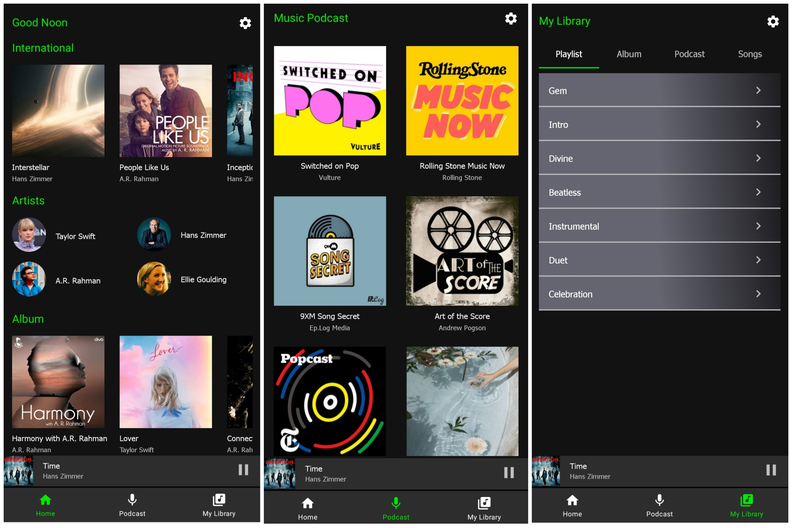
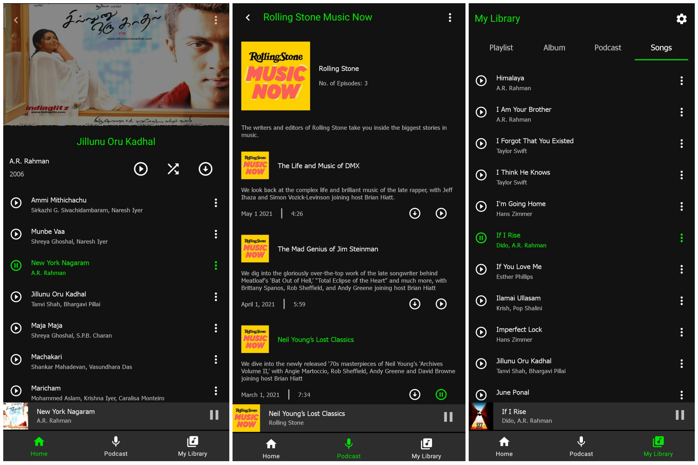

# Music Player UI

UI of an Android music player mobile app. 

##### Components
* RecyclerView - For the list of albums, podcasts, songs and episodes.
* Adapters - For list of albums, podcasts, songs and episodes.
* Extensions - Kotlin Extensions - For commonly used methods/operations.
* Shared Preferences - For storing and retrieving the last played song details even after killing the app.
* Binding Adapters - Managing UI through Kotlin code. 
* Tab Layout - For the list of menu under My Library.
* Bottom Navigation - Make the view as easy to get the app flow.
* Day & Night Theme - User convenient. 

#### Screens
* Home 
  * Top 4 albums in each category.
  * Full album view with list of songs.
* Podcast
  * Available podcasts
  * Full podcast view with the detailed information.
* My Library
  * Playlist view
  * User downloaded albums, songs and podcasts.
 
